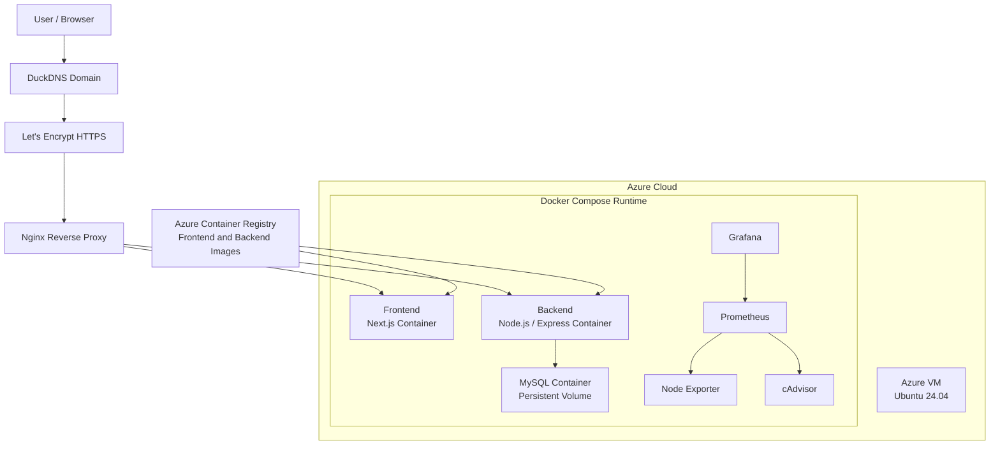
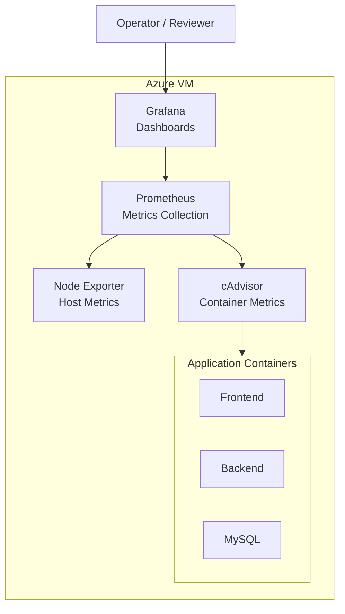

# Aji Tkhdem DevOps Deployment Project

> Production-style DevOps implementation for deploying a full-stack web application on Azure using Docker, GitHub Actions, Nginx, HTTPS, and a Prometheus/Grafana monitoring stack.

## Project Overview

This repository documents the DevOps implementation used to deploy **Aji Tkhdem**, an existing full-stack application, into a production-style cloud environment.

The main focus of this project is not application feature development. Instead, it demonstrates how a real web application can be containerized, delivered through CI/CD, deployed on a cloud virtual machine, exposed securely over HTTPS, and monitored using open-source observability tools.

The project is designed as a portfolio-ready DevOps case study for recruiters, hiring managers, and technical reviewers who want to evaluate practical deployment, automation, infrastructure, and operations skills.

## What This Project Demonstrates

- Containerized deployment of a full-stack application with Docker and Docker Compose
- CI/CD automation using GitHub Actions
- Docker image publishing to Azure Container Registry
- Remote deployment to an Azure Virtual Machine
- Reverse proxy configuration with Nginx
- HTTPS enablement using Let's Encrypt certificates
- DNS configuration using DuckDNS
- MySQL database deployment as a containerized service
- Infrastructure and container monitoring with Prometheus, Grafana, Node Exporter, and cAdvisor
- Separation of application runtime concerns from delivery and infrastructure concerns

## Architecture Overview

The application is deployed on an Ubuntu 24.04 Azure Virtual Machine. Docker Compose runs the application services, database, and monitoring stack. Nginx acts as the public entry point, routes traffic to the correct internal containers, and terminates HTTPS traffic using Let's Encrypt certificates.

The CI/CD pipeline builds the frontend and backend Docker images, pushes them to Azure Container Registry, then deploys the latest image versions on the Azure VM.


## Infrastructure Diagram



## Tech Stack

| Area | Technology |
| --- | --- |
| Cloud Provider | Microsoft Azure |
| Compute | Azure Virtual Machine, Ubuntu 24.04 |
| Containers | Docker, Docker Compose |
| Registry | Azure Container Registry |
| CI/CD | GitHub Actions |
| Reverse Proxy | Nginx |
| DNS | DuckDNS |
| TLS/HTTPS | Let's Encrypt |
| Frontend Runtime | Next.js |
| Backend Runtime | Node.js / Express |
| Database | MySQL |
| Metrics | Prometheus |
| Dashboards | Grafana |
| Host Metrics | Node Exporter |
| Container Metrics | cAdvisor |

## Infrastructure Overview

The deployment environment is built around a single Azure VM running Ubuntu 24.04. The VM acts as the production host for the complete application stack.

Core infrastructure responsibilities:

- Run Docker and Docker Compose on the VM
- Pull production images from Azure Container Registry
- Run frontend, backend, MySQL, and monitoring containers
- Persist MySQL and Grafana data using Docker volumes
- Expose application traffic through Nginx
- Route domain traffic from DuckDNS to the Azure VM
- Secure public access with HTTPS certificates from Let's Encrypt

The Docker Compose configuration is the operational definition of the runtime stack. It includes application services, database service, monitoring services, networking, health checks, and persistent volumes.

## CI/CD Workflow

The CI/CD process is implemented with GitHub Actions and split into two workflows:

- `.github/workflows/ci.yaml`: builds the application and pushes Docker images to Azure Container Registry
- `.github/workflows/deploy.yml`: connects to the Azure VM over SSH and deploys the latest container images

### CI/CD Pipeline Diagram

```mermaid
flowchart LR
    dev["Developer Push<br/>main branch"] --> gha["GitHub Actions"]
    gha --> testBuild["Install Dependencies<br/>Build Frontend"]
    testBuild --> dockerBuild["Build Docker Images"]
    dockerBuild --> acrLogin["Login to Azure Container Registry"]
    acrLogin --> pushBackend["Push Backend Image"]
    acrLogin --> pushFrontend["Push Frontend Image"]
    pushBackend --> deployWorkflow["Deployment Workflow"]
    pushFrontend --> deployWorkflow
    deployWorkflow --> ssh["SSH into Azure VM"]
    ssh --> pull["docker compose pull"]
    pull --> recreate["docker compose up -d<br/>--force-recreate"]
    recreate --> prune["docker image prune -f"]
    prune --> live["Updated Production Deployment"]
```



### Deployment Flow

1. Code is pushed to the `main` branch.
2. GitHub Actions checks out the repository.
3. Frontend dependencies are installed and the frontend production build is validated.
4. Backend dependencies are installed.
5. Docker images are built for frontend and backend services.
6. Images are pushed to Azure Container Registry.
7. A deployment workflow runs after a successful image build workflow.
8. GitHub Actions connects to the Azure VM using SSH.
9. The VM authenticates with Azure Container Registry.
10. Docker Compose pulls the latest images and recreates the running containers.
11. Old unused Docker images are pruned from the VM.

## Monitoring Stack

The monitoring layer is deployed with Docker Compose alongside the application runtime.

| Component | Purpose |
| --- | --- |
| Prometheus | Collects and stores time-series metrics |
| Grafana | Visualizes metrics through dashboards |
| Node Exporter | Exposes VM-level CPU, memory, disk, and network metrics |
| cAdvisor | Exposes Docker container resource metrics |

### Monitoring Architecture



## Security Considerations

This project applies common production deployment practices for a small self-managed cloud environment:

- Public traffic is routed through Nginx instead of exposing every service directly.
- HTTPS is enabled using Let's Encrypt certificates.
- CI/CD credentials are stored as GitHub Actions secrets.
- Azure Container Registry authentication is performed during CI/CD and deployment.
- The deployment workflow uses SSH key authentication to access the VM.
- MySQL data is stored in a Docker volume instead of inside disposable containers.
- Internal services communicate over a Docker network.
- Runtime configuration is provided through environment variables.

Recommended production hardening:

- Restrict direct access to Prometheus, Grafana, cAdvisor, and Node Exporter.
- Use a dedicated non-root deployment user on the VM.
- Rotate registry credentials and SSH keys regularly.
- Move sensitive runtime values to a managed secret store.
- Configure firewall rules to expose only required public ports.
- Add automated database backups.

## Deployment Overview

The VM deployment follows a pull-based container update model:

```bash
docker login <acr-login-server>
cd ~/aji_tkhdem
docker compose pull
docker compose up -d --force-recreate
docker image prune -f
```

In the automated workflow, these steps are executed remotely by GitHub Actions after a successful image build and push.

The production runtime is defined in:

- `docker-compose.yaml`
- `backend/Dockerfile`
- `frontend/Dockerfile`
- `.github/workflows/ci.yaml`
- `.github/workflows/deploy.yml`

## Project Structure

```text
.
|-- .github/
|   `-- workflows/
|       |-- ci.yaml              # Build, validate, and push Docker images to ACR
|       `-- deploy.yml           # Deploy latest images to the Azure VM over SSH
|-- backend/                     # Existing Node.js / Express application source
|-- frontend/                    # Existing Next.js application source
|-- docs/
|   |-- architecture/            # Architecture diagram exports and visual assets
|   `-- screenshots/             # Deployment, monitoring, and application screenshots
|-- docker-compose.yaml          # Production-style runtime stack
|-- package.json                 # Workspace-level helper scripts
`-- README.md                    # DevOps project documentation
```

The `backend/` and `frontend/` directories are included as the workload being deployed. The portfolio value of this repository is in the deployment architecture, automation, and operational setup around that workload.

## Screenshots

Add screenshots to `docs/screenshots/` as evidence of the live deployment and monitoring setup.

| Screenshot | Description |
| --- | --- |
| `docs/screenshots/app-home.png` | Public application running through the production domain |
| `docs/screenshots/https-certificate.png` | Browser certificate / HTTPS validation |
| `docs/screenshots/github-actions-build.png` | Successful build and push workflow |
| `docs/screenshots/github-actions-deploy.png` | Successful deployment workflow |
| `docs/screenshots/acr-images.png` | Frontend and backend images in Azure Container Registry |
| `docs/screenshots/grafana-dashboard.png` | Grafana dashboard for VM and container metrics |
| `docs/screenshots/prometheus-targets.png` | Prometheus targets showing healthy exporters |

## Environment and Secrets

The CI/CD workflows expect the following secrets to be configured in GitHub Actions:

| Secret | Purpose |
| --- | --- |
| `ACR_LOGIN_SERVER` | Azure Container Registry login server |
| `ACR_USERNAME` | Registry username or service principal username |
| `ACR_PASSWORD` | Registry password or service principal password |
| `AZURE_HOST` | Public IP or domain of the Azure VM |
| `AZURE_USER` | SSH username for the Azure VM |
| `AZURE_SSH_KEY` | Private SSH key used by the deployment workflow |

Runtime application values are provided through environment files on the deployment host.

## Future Improvements

- Replace manual VM provisioning with Terraform or Bicep.
- Add Ansible for repeatable VM configuration and Nginx setup.
- Add blue-green or rolling deployment strategy.
- Add automatic MySQL backups and restore testing.
- Add alerting through Grafana Alerting or Alertmanager.
- Add centralized logging with Loki or the ELK stack.
- Add image vulnerability scanning before pushing to ACR.
- Use immutable image tags instead of only `latest`.
- Add branch protection rules and required workflow checks.
- Add uptime monitoring for the public domain.

## Lessons Learned

- A working CI/CD pipeline is only valuable when deployment, secrets, runtime configuration, and rollback considerations are designed together.
- Docker Compose is a practical orchestration layer for small production-style deployments, especially when paired with a reverse proxy and persistent volumes.
- Monitoring should be deployed with the application from the beginning, not added after incidents occur.
- Separating build and deployment workflows makes the pipeline easier to understand, debug, and extend.
- ACR provides a clean boundary between CI image creation and VM runtime deployment.
- Documenting architecture and operational decisions is part of the engineering work, especially for portfolio and handoff scenarios.

## Professional Conclusion

This project presents a complete DevOps deployment path for a real full-stack application: containerization, registry-based delivery, automated deployment, HTTPS exposure, and operational monitoring.

It demonstrates practical skills across cloud infrastructure, Linux server deployment, Docker-based operations, GitHub Actions CI/CD, reverse proxy configuration, and observability. The result is a portfolio-quality DevOps project that shows not only that the application can run, but that it can be delivered, secured, monitored, and maintained in a production-style environment.
